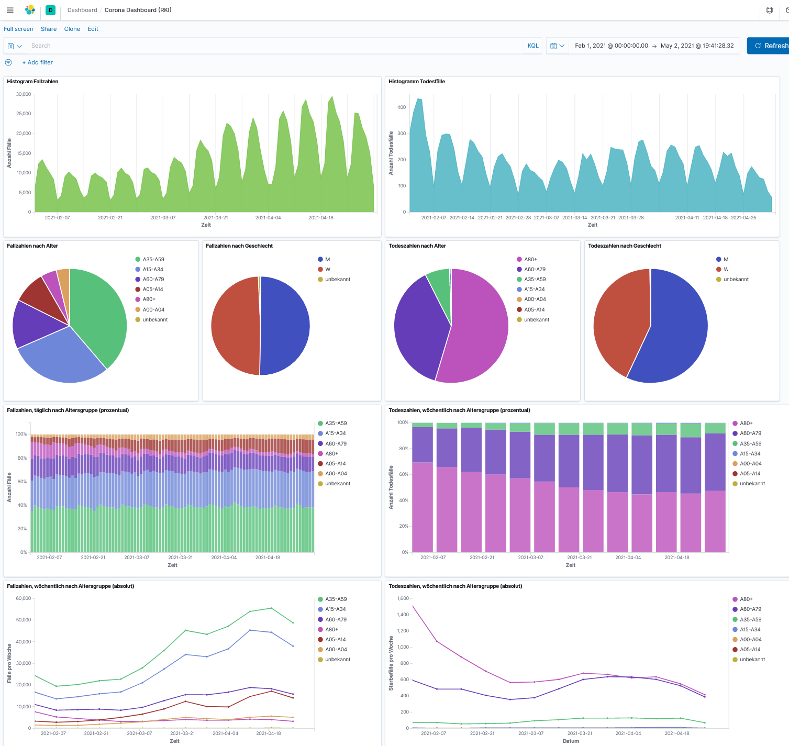

This script stores RKI's primary covid data (the case and death numbers that you see in the news every day) in Elasticsearch.
With the help of Kibana, the data can then interactively be explored.

To run the script, create a Python environment and run:
* conda install pandas
* conda install elasticseach
                                                              

